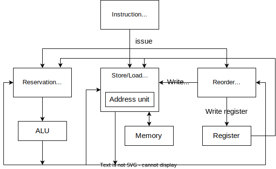

# RV32I Simulator

2022 编程综合实践大作业 壹，RV32I 指令集模拟器。

使用 Tomasulo 算法模拟指令并行。

框架图：

## 分支预测

### 静态预测（参照）

全部预测不跳转。

| 测试点         | 总分支数 | 预测成功次数 | 准确率 |
| -------------- | -------- | ------------ | ------ |
| array_test1    | 22       | 12           | 54.55% |
| array_test2    | 26       | 13           | 50.00% |
| basicopt1      | 155139   | 91497        | 58.98% |
| bulgarian      | 71493    | 36204        | 50.64% |
| expr           | 111      | 42           | 37.84% |
| gcd            | 120      | 75           | 62.50% |
| hanoi          | 17457    | 8725         | 49.98% |
| lvalue2        | 6        | 4            | 66.67% |
| magic          | 67869    | 36068        | 53.14% |
| manyarguments  | 10       | 8            | 80.00% |
| multiarray     | 162      | 30           | 18.52% |
| naive          | 0        | 0            | -nan   |
| pi             | 39956380 | 16889646     | 42.27% |
| qsort          | 200045   | 60027        | 30.01% |
| queens         | 77116    | 48754        | 63.22% |
| statement_test | 202      | 120          | 59.41% |
| superloop      | 435027   | 379755       | 87.29% |
| tak            | 60639    | 45479        | 75.00% |

### 两级自适应局部分支预测

自适应分支预测：记住过去 *n* 次执行该指令时的分支情况的历史，可能的 2*n* 种历史模式的每一种都有 1 个专用的二位饱和计数器，根据这个饱和计数器预测跳转还是不跳转。下面测试中取 *n* = 3。

局部分支预测：对于每个条件跳转指令都有专用的分支预测器。测试中使用 512 个分支预测器，并根据指令的 pc 值的哈希来选择使用哪个分支预测器。

表格的最后一列为 两级自适应局部预测准确率 与 静态预测准确率 的差值。

| 测试点         | 总分支数 | 预测成功次数 | 准确率 | 提升值 |
| -------------- | -------- | ------------ | ------ | ------ |
| array_test1    | 22       | 11           | 50.00% | -4.55% |
| array_test2    | 26       | 12           | 46.15% | -3.85% |
| basicopt1      | 155139   | 133950       | 86.34% | 27.36% |
| bulgarian      | 71493    | 67588        | 94.54% | 43.90% |
| expr           | 111      | 82           | 73.87% | 36.03% |
| gcd            | 120      | 84           | 70.00% | 7.50%  |
| hanoi          | 17457    | 14873        | 85.20% | 35.22% |
| lvalue2        | 6        | 4            | 66.67% | 0.00%  |
| magic          | 67869    | 55069        | 81.14% | 28.00% |
| manyarguments  | 10       | 8            | 80.00% | 0.00%  |
| multiarray     | 162      | 106          | 65.43% | 46.91% |
| naive          | 0        | 0            | NaN    | NaN    |
| pi             | 39956380 | 33578609     | 84.04% | 41.77% |
| qsort          | 200045   | 183334       | 91.65% | 61.64% |
| queens         | 77116    | 56356        | 73.08% | 9.86%  |
| statement_test | 202      | 128          | 63.37% | 3.96%  |
| superloop      | 435027   | 414364       | 95.25% | 7.96%  |
| tak            | 60639    | 45047        | 74.29% | -0.71% |
